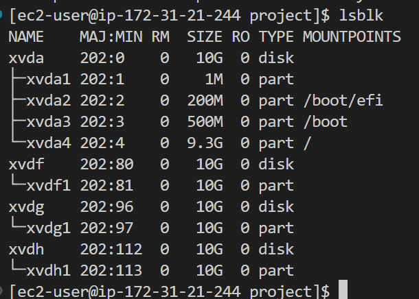
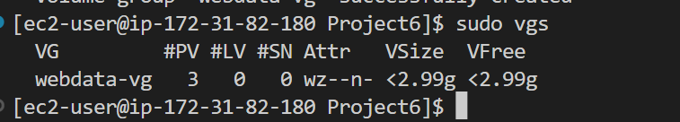
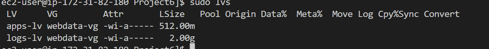
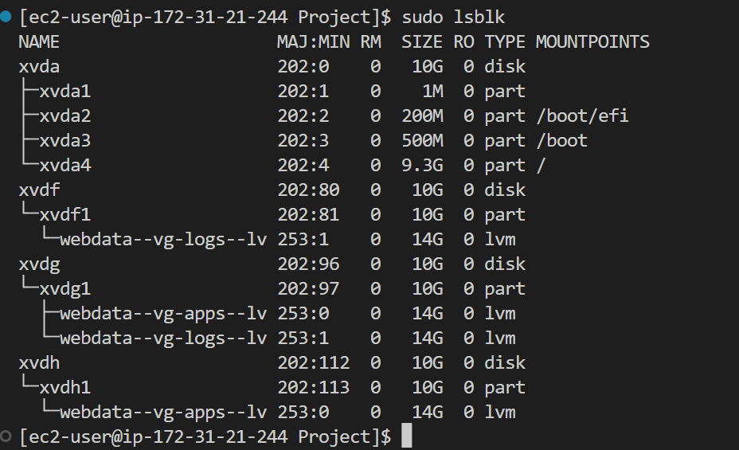
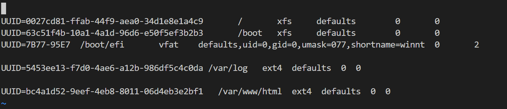
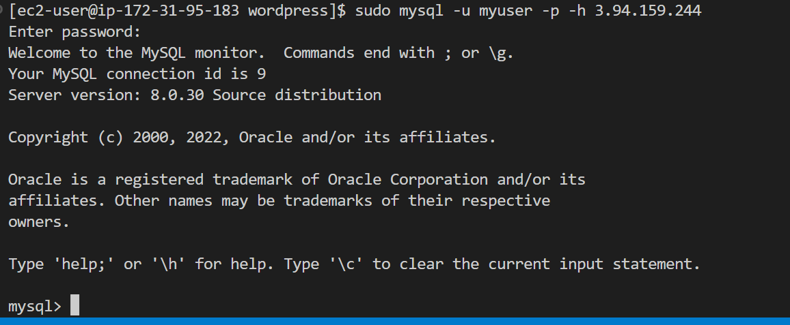
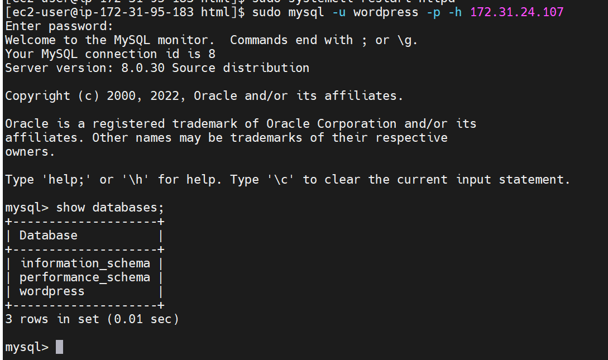
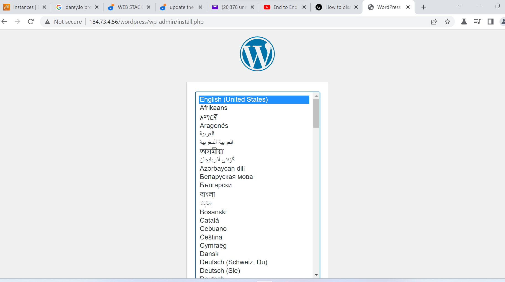
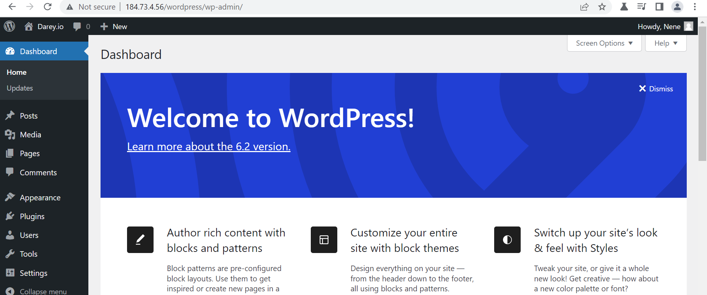

We are going to set up a 3-Tier architecture with
1. A Laptop or PC to serve as a client
2. An EC2 Linux Server as a web server (This is where you will install WordPress)
3. An EC2 Linux server as a database (DB) server

WE will use Redhat Linux systems for this project.

First of all, we will launch an EC2 instance that will serve as "Web Server". Create 3 volumes in the same AZ as our Web Server EC2, each of 10 GiB.

2. Then attach all three volumes one by one to your Web Server EC2 instance

3.  We will use `lsblk` to inspect the attached volumes

4. And `ls /dev` to inspect the attached devices in the /dev/ directory which is the Linux directory where all attached devices reside.
5. Use `df -h` to see all the mounts and free spaces on the server.

6.we will use gdisk utility to create a single partition on each of the 3 disks using this command 

$   sudo gdisk /dev/xvdf

$   sudo gdisk /dev/xvdg

$   sudo gdisk /dev/xvdh

Run this command `lsblk`  to view the  newly configured partition on each of the 3 disks.

Install lvm2 package using `sudo yum install lvm2`. Run sudo `lvmdiskscan` command to check for available partitions.

7. We create physical volumes on the three disk using the `pvcreate` utility

$ sudo pvcreate /dev/xvdf1 /dev/xvdg1 /dev/xvdh1

8. And  `sudo pvs` to see the output

9. Next we create volume group with vgcreate utility to add all 3 PVs to a volume group (VG). Name the VG webdata-vg. use this command

$  sudo vgcreate webdata-vg /dev/xvdh1 /dev/xvdg1 /dev/xvdf1

10 Run `sudo vgs` to see this output

11.Create two logical volumes using the `lvcreate` utility thus apps-lv will be used to store data and will be half of the pv size; while logs-lv will store logs and take the remaining half.

$ sudo lvcreate -n apps-lv -L 14G webdata-vg

$  sudo lvcreate -n logs-lv -L 14G webdata-vg

12. verify the created volumes with this command

  $sudo lvs

  

13.Verify the entire setup with these commands

$  sudo vgdisplay 
$  sudo lsblk  

14. Use mkfs.ext4 to format the logical volumes with ext4 filesystem using this command

$  sudo mkfs -t ext4 /dev/webdata-vg/apps-lv
$  sudo mkfs -t ext4 /dev/webdata-vg/logs-lv

15. Create /var/www/html directory to store website files using

$  sudo mkdir -p /var/www/html

16. Create /home/recovery/logs to store backup of log data

$ sudo mkdir -p /home/recovery/logs

17. Mount /var/www/html on apps-lv logical volume using this command

  $ sudo mount /dev/webdata-vg/apps-lv /var/www/html/

18. Use rsync utility to backup all the files in the log directory /var/log into /home/recovery/logs (This is required before mounting the file system)

$ sudo rsync -av /var/log/. /home/recovery/logs/

19. Mount /var/log on logs-lv logical volume. (Note that all the existing data on /var/log will be deleted. That is why backing up the files in step 15 above is very
important)
use this command

$  sudo mount /dev/webdata-vg/logs-lv /var/log

20. Restore log files back into /var/log directory with this command

$ sudo rsync -av /home/recovery/logs/. /var/log

 21. Update the /etc/fstab file otherise the confiruratiomn will disppear
 22. The UUID of the device will be used to update the /etc/fstab file;

23. Run this `sudo blkid` and copy the UUID to use and update the /etc/fstab file

24. Test the configuration with 1sudo mount -a and reload the daemon

 $  sudo mount -a
 $  sudo systemctl daemon-reload

Launch a second RedHat Ec2 instance for a Database server
 Configure the Database Server following the above steps above but changing the names.
Instead of apps-lv create db-lv and mount it to /db directory instead of /var/www/html/.

### Step 2
Install wordpress on the webserver

1. sudo yum update -y

2. Install wget, Apache and it’s dependencies

$  sudo yum -y install wget httpd php php-mysqlnd php-fpm php-json

3. Start Apache with following commands

sudo systemctl enable httpd
sudo systemctl start httpd

4. To install PHP and it’s depemdencies with the following commands

$  sudo yum install https://dl.fedoraproject.org/pub/epel/epel-release-latest-8.noarch.rpm

$   sudo yum install yum-utils http://rpms.remirepo.net/enterprise/remi-release-8.rpm

$  sudo yum module list php

$   sudo yum module reset php

$   sudo yum module enable php:remi-7.4

$   sudo yum install php php-opcache php-gd php-curl php-mysqlnd

$sudo systemctl start php-fpm

$  sudo systemctl enable php-fpm

$ setsebool -P httpd_execmem 1

5. Restart Apache with this command

 $  sudo systemctl restart httpd

6. Download wordpress and copy wordpress to var/www/html

 $ mkdir wordpress && cd   wordpress

 $ sudo wget http://wordpress.org/latest.tar.gz

 $ sudo tar xzvf latest.tar.gz

 $  sudo rm -rf latest.tar.gz

 $ cp wordpress/wp-config-sample.php wordpress/wp-config.php

 $  cp -R wordpress /var/www/html/

7. Configure SELinux Policies

 $  sudo chown -R apache:apache /var/www/html/wordpress

 $ sudo chcon -t
 httpd_sys_rw_content_t /var/www/html/wordpress -R

 $  sudo setsebool -P httpd_can_network_connect=1

  $ sudo setsebool -P httpd_can_network_connect_db 1

  Step 4 — Install MySQL on your DB Server EC2

$   sudo yum update

$   sudo yum install mysql-server

$  sudo systemctl restart mysqld

$  sudo systemctl enable mysqld

$ sudo systwmctl status mysqld

Step 5 — Configure DB to work with WordPress

   sudo mysql

  CREATE DATABASE wordpress;

CREATE USER `myuser`@`<Web-Server-Private-IP-Address>` IDENTIFIED BY 'wordpress';
GRANT ALL ON wordpress.* TO 'wordpress'@'<Web-Server-Private-IP-Address>';
FLUSH PRIVILEGES;

SHOW DATABASES;

exit

Step 6 — Configure WordPress to connect to remote database.

Open mysql port 3306 on DB server EC2

vi into /etc/my.cnf file and modify the bind address by adding the following

[mysqld]
bind-adress=0.0.0.0

step 7 In the webserver, Install MySQL client and test that you can connect from your Web Server to your DB server by using mysql-client

$  sudo yum install mysql

Step 8 vi into wp-config.php fike and edit content with the DB name, user name and user 
password and ip address

restart apache after the modification

sudo systemctl restart httpd

Step 9 Connect to the database from the webserver by running this command

$  sudo mysql -u admin -p -h <DB-Server-Private-IP-address>

 and execute `SHOW DATABASES`; command to see a list of existing databases.

 

Access from your browser the link to your WordPress http://<Web-Server-Public-IP-Address>/wordpress/

Installed and signed into wordpress

Project completed

