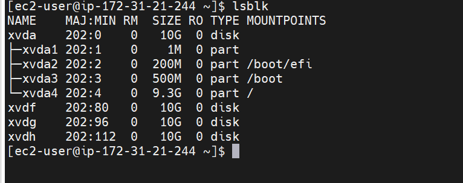

We are going to set up a 3-Tier architecture with
1. A Laptop or PC to serve as a client
2. An EC2 Linux Server as a web server (This is where you will install WordPress)
3. An EC2 Linux server as a database (DB) server

WE will use Redhat Linux systems for this project.

First of all, we will launch an EC2 instance that will serve as "Web Server". Create 3 volumes in the same AZ as our Web Server EC2, each of 10 GiB.

2. Then attach all three volumes one by one to your Web Server EC2 instance

3.  We will use `lsblk` to inspect the attached volumes

4. And `ls /dev` to inspect the attached devices in the /dev/ directory which is the Linux directory where all attached devices reside.
5. Use `df -h` to see all the mounts and free spaces on the server.

6.we will use gdisk utility to create a single partition on each of the 3 disks using this command 

$   sudo gdisk /dev/xvdf

$   sudo gdisk /dev/xvdg

$   sudo gdisk /dev/xvdh

Run this command `lsblk`  to view the  newly configured partition on each of the 3 disks.

Install lvm2 package using `sudo yum install lvm2`. Run sudo `lvmdiskscan` command to check for available partitions.

7. We create physical volumes on the three disk using the `pvcreate` utility

$ sudo pvcreate /dev/xvdf1 /dev/xvdg1 /dev/xvdh1

8. And  `sudo pvs` to see the output

9. Next we create volume group with vgcreate utility to add all 3 PVs to a volume group (VG). Name the VG webdata-vg. use this command

$  sudo vgcreate webdata-vg /dev/xvdh1 /dev/xvdg1 /dev/xvdf1

10 Run `sudo vgs` to see this output

11.Create two logical volumes using the `lvcreate` utility thus apps-lv will be used to store data and will be half of the pv size; while logs-lv will store logs and take the remaining half.

$ sudo lvcreate -n apps-lv -L 14G webdata-vg

$  sudo lvcreate -n logs-lv -L 14G webdata-vg

12. verify the created volumes with this command

  $sudo lvs

  

13.Verify the entire setup with these commands

$  sudo vgdisplay 
$  sudo lsblk  

14. Use mkfs.ext4 to format the logical volumes with ext4 filesystem using this command

$  sudo mkfs -t ext4 /dev/webdata-vg/apps-lv
$  sudo mkfs -t ext4 /dev/webdata-vg/logs-lv

15. Create /var/www/html directory to store website files using

$  sudo mkdir -p /var/www/html

16. Create /home/recovery/logs to store backup of log data

$ sudo mkdir -p /home/recovery/logs

17. Mount /var/www/html on apps-lv logical volume using this command

  $ sudo mount /dev/webdata-vg/apps-lv /var/www/html/

18. Use rsync utility to backup all the files in the log directory /var/log into /home/recovery/logs (This is required before mounting the file system)

$ sudo rsync -av /var/log/. /home/recovery/logs/

19. Mount /var/log on logs-lv logical volume. (Note that all the existing data on /var/log will be deleted. That is why backing up the files in step 15 above is very
important)
use this command

$  sudo mount /dev/webdata-vg/logs-lv /var/log

20. Restore log files back into /var/log directory with this command

$ sudo rsync -av /home/recovery/logs/. /var/log
 21. Update the /etc/fstab file otherise the confiruratiomn will disppear

